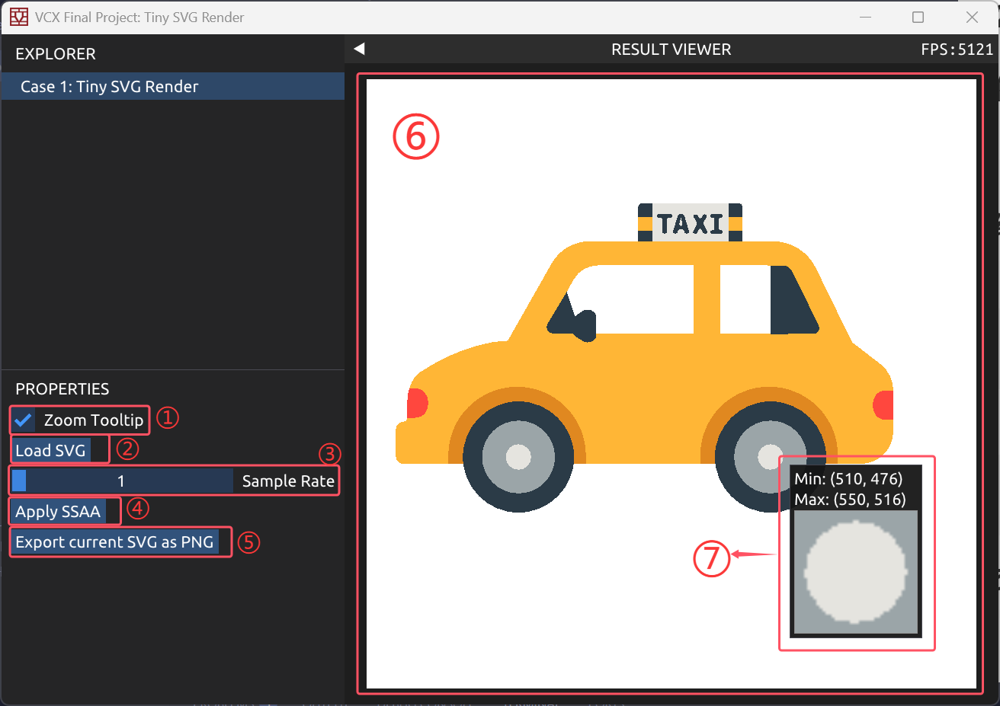
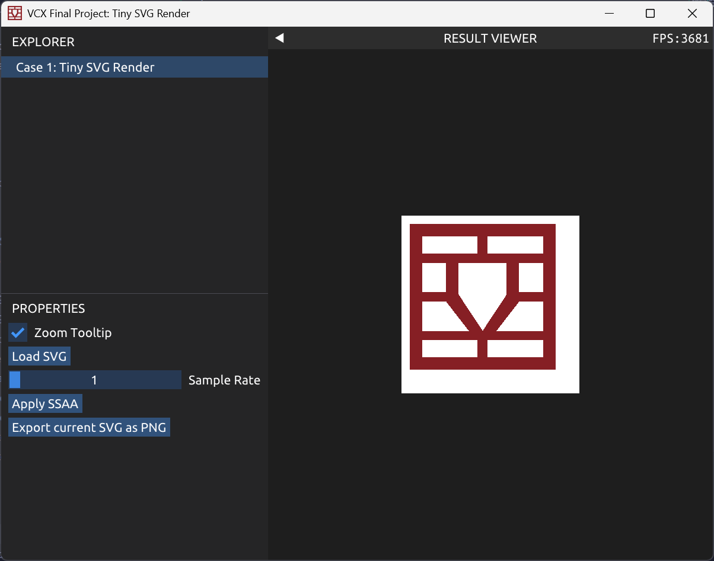
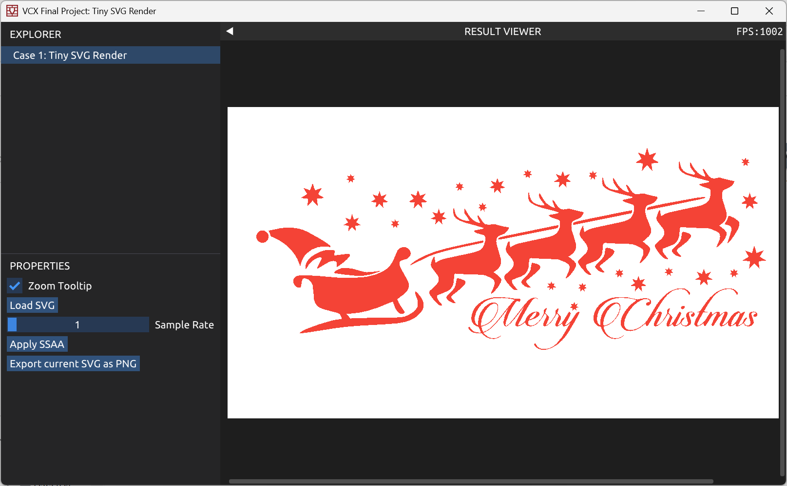
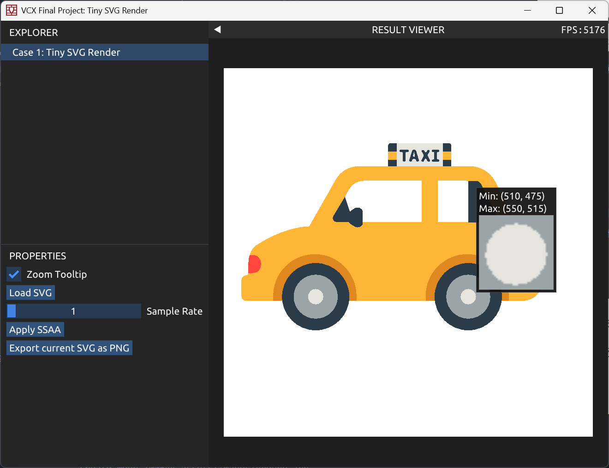
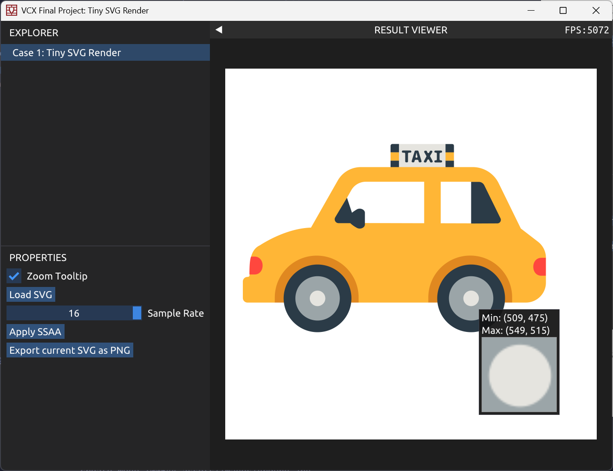

# Tiny SVG Renderer

该项目为北京大学 2025 秋季学期本科生课程 [可视计算与交互概论](https://vcl.pku.edu.cn/course/vci) (Introduction to Visual Computing and Interaction) 课程大作业。基于课程 [Lab0](https://vcl.pku.edu.cn/course/vci/lab0) 的代码框架开发，实现了一个简易的 SVG 渲染器。

## 1. 功能

- 支持解析常见的 SVG 几何形状，如 Rect, Circle, Ellipse, Line, Polygon 等
- 支持解析 SVG 路径 (Path) 属性
- 支持解析常见的 SVG 变换 (transform) ，如 Translate, Rotate, Scale, Skew, Matrix
- 支持解析常见的样式 (Style) 属性，如 Fill, Stroke, Opacity 等 
- 提供了 SSAA 反走样选项，支持 1-16 倍采样倍数
- 支持导出图片

## 2. 快速开始

### 依赖环境
- C++20
- Xmake，可通过 [Xmake 安装说明](https://xmake.io/zh/guide/quick-start#installation) 进行安装

### 编译步骤

1. 克隆本仓库

```bash
git clone https://github.com/VVKAHPM/VCI-Final-Project-Tiny-SVG-Renderer.git
cd VCI-Final-Project-Tiny-SVG-Renderer
```

2. 进入项目主目录，执行如下命令，你将看到一个交互页面

```bash
xmake
xmake run svg
```

### 交互页面说明



1. 放大镜工具，开启后可通过鼠标悬停放大区域像素（7.）
2. 加载您的 SVG 文件 
3. 控制 SSAA 的采样频率，通过鼠标拖动更改
4. 应用 SSAA 反走样技术，注意拖动后需要应用更改才会生效
5. 将当前渲染好的图片导出为 PNG 格式图片
6. 画布，您的 SVG 文件将在这里渲染
7. 放大镜效果

特别地，图片渲染好之后将在 UI 界面 `Export current SVG as PNG` 按钮下显示一条持续 2 秒的提示

## 3. 项目结构

基于 Lab0 框架，Tiny SVG Render 的主要结构如下：

```css
src/VCX/Labs/0-GettingStarted
├── App.cpp/h # 程序启动设置
├── CaseSVG.cpp/h # Tiny SVG Render UI 设置
├── main.cpp # 主程序
├── portable-file-dialogs.h # 文件处理库函数
├── SVGData.h # 图元数据结构
├── SVGParser.cpp/h # 负责 XML 解析、样式继承及几何形状路径化
├── SVGRasterizer.cpp/h: 核心渲染引擎
```

## 4. 示例

在 assets/images 文件夹中，我提供了一些简单的 SVG 图片作为示例。

- vcl-logo.svg



- music.svg


- christmas.svg



---

下面演示 SSAA 效果：

- 无 SSAA 反走样：



- 16x SSAA 反走样：



## 5. 参考

- [MDN Web Docs SVG tutorial](https://developer.mozilla.org/zh-CN/docs/Web/SVG)
- [SVG 1.1 标准](https://www.w3.org/TR/SVG11/)

## 6. 致谢

- 感谢陈宝权、楚梦渝老师的悉心授课，以及助教团队为本课程精心编写的 [Lab 框架](https://gitee.com/pku-vcl/vci-2025)。
- 感谢 Lab0 框架底层所采用的一系列开源技术。
- 感谢 [tinyxml2](https://github.com/leethomason/tinyxml2) 提供的 XML 解析方案；
- 感谢 [Portable File Dialogs](https://github.com/samhocevar/portable-file-dialogs) 实现了简洁的跨平台原生文件对话框。
- 感谢 [SVG Viewer](https://www.svgviewer.dev/) 和 [SVG SILH](https://svgsilh.com/zh/f44336/) 上的精美 SVG 图片。

## 7. 许可证

本项目个人开发部分的代码采用 **MIT 许可证** 开源。详情请参阅 LICENSE 文件。

开发过程中使用的第三方库与框架，其版权归原作者所有，并遵循各自的开源协议。